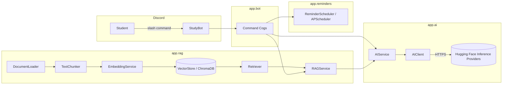

# StudyBot — From Bot to Brain 🎓🤖

A Discord AI study assistant, built as the reference implementation for a
3-hour "From Bot to Brain" AI-engineering workshop. It progressively
demonstrates: bots & events, calling an LLM API, prompt engineering,
Retrieval-Augmented Generation (RAG), embeddings, vector search, and
background/scheduled tasks — using a small, readable codebase.

## 1. Project overview

StudyBot lives in Discord. Students can:
- Ask general questions (`/ask`)
- Upload a PDF of their course material (`/document`)
- Ask questions grounded in that material via RAG (`/ask` automatically uses
  it once something is indexed)
- Get a summary, a quiz, or flashcards generated from the material
  (`/summary`, `/quiz`, `/flashcards`)
- Set study reminders (`/remind`)

## 2. Features

| Command | Description |
|---|---|
| `/start` | Welcome message |
| `/help` | List all commands |
| `/ask <question>` | Ask anything — uses RAG automatically if material is indexed |
| `/document <file>` | Upload and index a PDF as course material |
| `/summary` | Summarize the indexed material |
| `/quiz` | Generate a 5-question quiz from the material |
| `/flashcards` | Generate flashcards from the material |
| `/remind time:HH:MM message:...` | Schedule a one-off study reminder |
| `/status` | Check AI/RAG configuration status |
| `/clear` | Clear the indexed material |

## 3. Architecture diagram



## 4. Tech stack

- Python 3.11+
- `discord.py` (slash commands via `app_commands`)
- **Hugging Face Inference Providers** (free-tier cloud API) for chat/text
  generation — `/ask`, `/summary`, `/quiz`, `/flashcards`
- **sentence-transformers** (local, offline Python library) for embeddings —
  no API key, no cost, no rate limit
- `chromadb` as a local, file-based vector store
- `PyMuPDF` for PDF text extraction
- `APScheduler` for reminders
- `pytest` for tests

This entire stack is free to run: Hugging Face's Inference Providers have a
free tier with monthly credits, and sentence-transformers runs on your own
machine with no account at all.

## 5. Prerequisites

- Python 3.11 or newer
- A Discord account + a Discord server you can add a bot to
- A free Hugging Face account and token (optional for basic bot testing and
  for indexing documents, required only for `/ask`, `/summary`, `/quiz`,
  `/flashcards`)

## 6. Installation (Windows / PowerShell)

```powershell
# From the project root
python -m venv .venv
.venv\Scripts\Activate.ps1
pip install -r requirements.txt
```

macOS/Linux equivalent:

```bash
python3 -m venv .venv
source .venv/bin/activate
pip install -r requirements.txt
```

## 7. Environment variables

Copy `.env.example` to `.env` and fill in the values:

```powershell
Copy-Item .env.example .env
```

```bash
cp .env.example .env   # macOS/Linux
```

| Variable | Purpose |
|---|---|
| `DISCORD_TOKEN` | Your Discord bot token |
| `HF_API_KEY` | Your Hugging Face token, used for chat/text generation |
| `HF_MODEL` | Which model to use on Hugging Face's Inference Providers |
| `EMBEDDING_MODEL` | Local sentence-transformers model name (no key needed) |
| `CHUNK_SIZE`, `CHUNK_OVERLAP`, `RAG_TOP_K` | RAG tuning (sane defaults provided) |

**Never commit your `.env` file.** It contains secrets (your Discord token
and Hugging Face token). Anyone with these could impersonate your bot or use
up your Hugging Face free-tier credits. `.gitignore` already excludes `.env`
for you.

## 8. Discord bot setup

1. Go to https://discord.com/developers/applications and click **New
   Application**.
2. Under **Bot**, click **Add Bot**, then **Reset Token** and copy it into
   `DISCORD_TOKEN` in your `.env`.
3. Under **Bot → Privileged Gateway Intents**, enable **Message Content
   Intent**.
4. Under **OAuth2 → URL Generator**, select scopes `bot` and
   `applications.commands`, and permissions `Send Messages`,
   `Read Message History`, `Attach Files`. Copy the generated URL.
5. Open that URL in a browser and invite the bot to your test server.

## 9. AI provider setup — Hugging Face (free)

1. Create a free account at https://huggingface.co
2. Go to https://huggingface.co/settings/tokens/new and create a
   **fine-grained** token with the **"Make calls to Inference Providers"**
   permission enabled.
3. Put it in `.env` as `HF_API_KEY`.
4. `HF_MODEL` defaults to `meta-llama/Llama-3.1-8B-Instruct`, a good
   free-tier chat model. You can swap in any chat model listed at
   https://huggingface.co/docs/inference-providers.

Hugging Face's free tier gives monthly inference credits — plenty for a
workshop, but they are not unlimited like the local embedding step below.

If `HF_API_KEY` is missing, the bot still starts and indexing documents
still works (embeddings are local), but `/ask`, `/summary`, `/quiz`,
`/flashcards` reply with a friendly configuration message instead of
crashing.

## 10. RAG setup

The pipeline is:

```
PDF → DocumentLoader → TextChunker → EmbeddingService (local, sentence-transformers) → VectorStore (Chroma)
                                                                                            │
question ──► EmbeddingService ──► Retriever ────────────────────────────────────────────────┘
                                      │
                          relevant chunks ──► AIService (Hugging Face) ──► answer
```

Indexing a document (`/document` or the CLI below) needs **no Hugging Face
key at all** — embeddings run locally via sentence-transformers. Only
`/ask`, `/summary`, `/quiz`, `/flashcards` need `HF_API_KEY`, since those
generate text.

Index the provided sample document:

```powershell
python -m app.rag.ingest data/sample_course.pdf
```

You'll see output like:

```
Loading and indexing: data/sample_course.pdf
Ingestion complete:
  Pages extracted:   5
  Characters:        2512
  Chunks created:    4
  Embeddings made:   4
  Vector store dir:  <project>/data/vector_store
Successfully indexed! You can now use /ask, /summary, /quiz, /flashcards in Discord.
```

You can also index a document straight from Discord using `/document` with
a PDF attachment.

## 11. Running the project

```powershell
python -m app.main
```

You should see:

```
✅ StudyBot is online as StudyBot#1234
```

## 12. Testing

```powershell
pytest -q
```

Expected output:

```
36 passed in ~2s
```

No AI API key or Discord token is required — all external calls are mocked
with a `FakeAIClient` in `tests/conftest.py`.

## 13. Manual Testing Checklist

1. **Create the environment**: `python -m venv .venv`
2. **Activate it**: `.venv\Scripts\Activate.ps1`
3. **Install dependencies**: `pip install -r requirements.txt`
4. **Configure `.env`**: copy `.env.example` → `.env`, fill in
   `DISCORD_TOKEN` and `HF_API_KEY`
5. **Start the bot**: `python -m app.main` → expect `✅ StudyBot is online...`
6. **Invite the bot** to your test server using the OAuth2 URL from step 8
   above
7. **Test `/help`**: run it in Discord → expect the command list
8. **Test `/ask`**: `/ask What is a deadlock?` → expect a general AI answer
   (no material indexed yet)
9. **Index a PDF**: `python -m app.rag.ingest data/sample_course.pdf` →
   expect the stats printout shown in section 10
10. **Test RAG**: `/ask What is a deadlock?` again → expect a reply starting
    with "📘 According to your course material..."
11. **Test `/summary`** → expect a bullet-point summary of the sample PDF
12. **Test `/quiz`** → expect 5 numbered multiple-choice questions
13. **Test `/flashcards`** → expect `Q:`/`A:` pairs
14. **Test `/remind`**: `/remind time:18:05 message:"Revise chapter 3"` →
    expect a confirmation, then a `🔔` reminder message in the channel at
    that time

## 14. Workshop checkpoints

| Checkpoint | What it demonstrates | Key files |
|---|---|---|
| 1 — Basic Discord bot | Events, slash commands | `app/bot/bot.py`, `app/bot/commands/basic.py` |
| 2 — AI-powered bot | Calling an LLM API, prompt engineering | `app/ai/client.py`, `app/ai/prompts.py`, `app/bot/commands/ai_commands.py` |
| 3 — RAG-powered assistant | Chunking, embeddings, vector search | `app/rag/*` |
| 4 — Reminders / background tasks | Scheduled async jobs | `app/reminders/scheduler.py` |
| 5 — Final project | Everything wired together, error handling, tests | whole repo |

See `docs/workshop.md` for the full 3-hour presentation plan.

## 15. Troubleshooting

- **Bot doesn't come online**: check `DISCORD_TOKEN` in `.env` and that
  Message Content Intent is enabled in the Developer Portal.
- **Slash commands don't show up**: Discord can take up to an hour to
  propagate global command syncs the first time; try kicking and
  re-inviting the bot, or restart it once more.
- **`/ask` says AI is not configured**: set `HF_API_KEY` in `.env` and
  restart the bot.
- **Ingestion fails with "no extractable text"**: the PDF is likely scanned
  images rather than real text; use a text-based PDF.
- **Rate limit / quota errors**: the bot surfaces a short friendly message
  in Discord and logs the full error locally — check your provider's usage
  dashboard.

## 16. Ideas for extensions

See the workshop challenge in `docs/workshop.md` — add `/explain`,
`/studyplan`, natural-language reminder times, per-user document spaces, or
a small web dashboard (FastAPI) that shows indexed material and reminder
history without touching the bot's core logic.

## Project structure

```
studybot/
├── app/
│   ├── bot/            # Discord layer (bot, events, command cogs)
│   ├── ai/             # LLM client, prompts, AIService
│   ├── rag/            # DocumentLoader, TextChunker, EmbeddingService,
│   │                   # VectorStore, Retriever, RAGService, ingest CLI
│   ├── reminders/      # ReminderScheduler
│   ├── utils/          # Discord message-splitting helper
│   ├── config.py
│   └── main.py
├── data/               # sample_course.pdf, vector_store/ (generated)
├── tests/              # pytest suite (36 tests, fully mocked)
├── docs/               # architecture.md, rag.md, discord-bot.md, workshop.md
├── .env.example
├── .gitignore
├── requirements.txt
└── pyproject.toml
```
