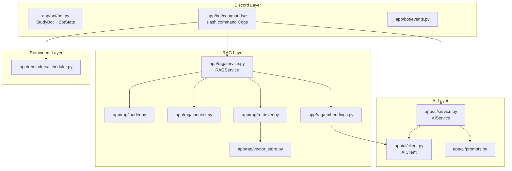

# Architecture

StudyBot is organized in four layers, each with a single responsibility.
This separation is what makes the codebase teachable: every file answers
one question.

## Why this shape?

- **`app/bot`** never talks to the LLM or the vector store directly — it
  only calls `AIService` and `RAGService` methods. This means you can test
  the AI/RAG logic without ever starting Discord.
- **`app/ai`** knows nothing about Discord or PDFs. It turns `(question,
  optional context)` into text. `AIClient` is the only place that talks to
  the network, which is also the only class that needs mocking in tests.
- **`app/rag`** is split into one small class per pipeline stage
  (`DocumentLoader`, `TextChunker`, `EmbeddingService`, `VectorStore`,
  `Retriever`), orchestrated by `RAGService`. Each stage can be explained
  and tested on its own.
- **`app/reminders`** wraps APScheduler behind a tiny interface
  (`schedule_reminder`) so the rest of the app doesn't need to know which
  scheduling library is used.

## BotState

`app/bot/bot.py` builds all shared services once, at startup, inside
`BotState`, and hangs them off `bot.state`. Command Cogs receive `self.bot`
and read `self.bot.state.ai_service`, `self.bot.state.rag_service`, etc.
This avoids global variables while keeping dependency wiring in one visible
place — good for explaining "where does this bot get its AI client from?"
in five seconds during the workshop.

## Error handling philosophy

- Configuration problems (missing API key, missing Discord token) raise a
  `ConfigError` with a plain-English message, caught at the command level
  and shown to the user without a stack trace.
- Network/provider errors from `AIClient` are wrapped in `RuntimeError` with
  the underlying message, logged with `logger.exception` (full traceback in
  your terminal), and surfaced to Discord as a short friendly sentence.
- Document/RAG errors (`DocumentLoadError`, empty retrieval, etc.) are
  handled the same way — technical detail stays in the logs, the user sees
  a clear next step.
